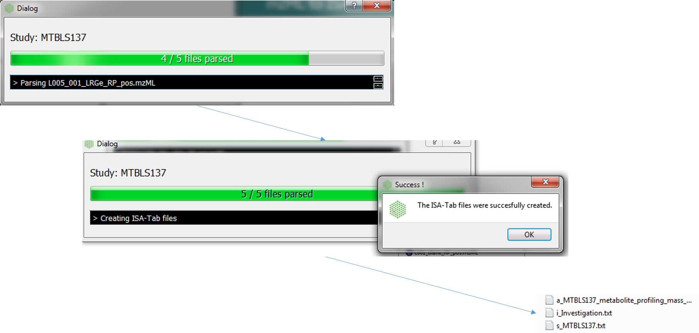

Usage
=====

Folder structure
----------------

For mzML files, mzml2isa only requires that you put all you files in
the same folder, and parsing should work fine. Note that reference to
RAW files is extracted from the mzML files, so if you plan to create an
ISA archive after mzml2isa creates ISA files, don't forget to include
those as well.

Example structure::

   /
   └ home/
     └ metabolomics/
       └ MZML study1/      # the name of the folder doesn't matter
         ├ Sample1.mzML   # the name of the file must correspond to the sample name
         ├ Sample2.mzML
         └ ...
       └ MZML study2/      # the name of the folder doesn't matter
         ├ Sample1.mzML   # the name of the file must correspond to the sample name
         ├ Sample2.mzML
         └ ...

Starting interface 
----------------

1.  Directory containing the mzML files. e.g. 'MZML study1' in the above example
2.  Output folder (automatically the same as input)
3.  Study name (automatically the same as the input folder name, e.g. 'MZML study1' in the above example)
4.  If the 'input folder' contains multiple studies then mzML2ISA will be run each study, e.g. in the above example if 'metabolomics' folder was chosen as the 'input folder' then the parsing will be performed on both studies ('MZML study 1', 'MZML study 2')
5.  If selected, seperate assay files will be created for positive and negative assays
6.  If selected, the output folder will be the same as the input folder and input folder name will be used as the study name
7.  The 'Add Metadata' button will open a new dialog box where users can add more metadata
8.  Start the conversion process!

Adding additional metadata
----------------
Users can add additional metadata manually through the dialog box below. However, all this information can be added at the final stage with ISAcreator tool.

Conversion
----------------
The following dialog boxes after the convert button is pressed. By default this is run in parallel (multiple cores). The following file types will be generated Investigation, Study and Assay

Editing with ISAcreator
----------------

The ISA-Tab structure can be further populated with the `ISAcreator software  <http://isa-tools.org/software-suite/>`__.

The workflow being as follows:

1.  Open the ISAcreator software (available for Mac, Linux and Windows)
2.  Select the ISAcreator button
3.  Login (create a profile if the first time being used)
4.  Choose a configuration that is suited for the study
5.  Choose the 'Load and existing isatab file' option
6.  Click on the 'open another' button and find the folder containing the newly created ISA-tab files
7.  Fill all remaining fields with ISAcreator

A video of the standard Metabolights procedure can be found on  `youtube  <https://www.youtube.com/watch?v=LJFf4O6QPl8/>`__.

